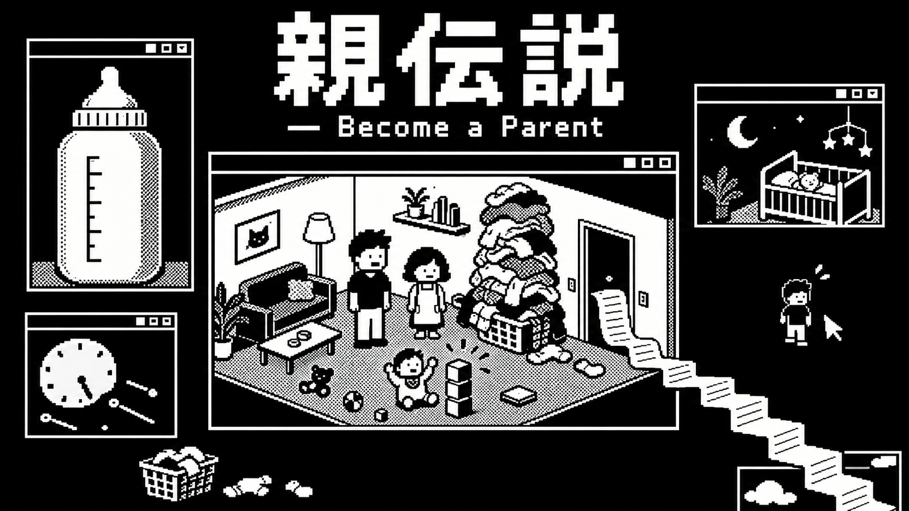

# アートディレクション

状態：基準画像の採用はユーザー合意済み（2026-09-14、D-020）。以下の制作指針は採用画像の特徴を言語化したもの。今後のイラストは、この画像を実際に参照して制作する。

## 正式なHERO画像

- 正本：[assets/marketing/hero.png](../assets/marketing/hero.png)
- 採用した候補：B「育児デスクトップ」。[候補の原本](../assets/marketing/hero-digital-b-v1.png)と同一の画像を保存。
- 形式・サイズ：PNG、1672 × 941 px。
- タイトルの正式表記は[ゲーム企画](game-concept.md)を正本とする。HERO内の大きな日本語タイトルと、小さな英語副題のドット文字による表現も採用する。
- [元の生成プロンプト](../assets/marketing/hero-digital-prompts.md)は制作履歴。実画像を画風の判断基準とし、プロンプトに書かれた仮の解像度等を確定仕様にはしない。

## 今後の制作で揃える特徴

| 要素 | 基準画像から引き継ぐ特徴 |
| --- | --- |
| 色・質感 | 黒背景と白を主体にした1bit風。粗いドット、段差のある輪郭、規則的なディザで明暗を表す |
| デジタル感 | 古いPCのウィンドウ、四角い枠、ピクセル状の文字や記号。場面に合う範囲で取り入れる |
| 人物 | 大きめの四角い頭、簡素な体、少数の点と線による顔。繰り返し登場する人物は髪形・服・体格の識別点を揃える |
| 空間 | 小さな部屋や生活道具を読み取れる構図。黒い余白を残し、細部を詰め込みすぎない |
| シュールさ | 人より大きい洗濯物、窓の外へ続くレシート、取り残された人物など、日常を少し誇張する |
| 感情 | 生活の忙しさと親の戸惑いを、淡々とした表情や間で描く。子どもの楽しさと家族への親しみを残す |
| タイトル | 太く角張った日本語のドット文字を主役に、英語副題を小さく配置。タイトル入り画像では正式表記を照合する |

色数を増やす、写実的・筆描き中心にする、強いホラーへ寄せるなどの変更は、現行の基準に沿う調整と区別する。別の方向をユーザーが指定した場合は、その依頼と採用判断を記録する。

## 制作手順

1. 本文と正式HEROの実画像を確認する。画像生成では `assets/marketing/hero.png` をスタイルの参照画像として渡す。文章の説明だけに置き換えない。
2. 対象場面、人物、用途、必要なサイズ、画像に入れる文字を依頼に合わせる。HEROの構図を全イラストで繰り返す必要はない。
3. 同じ人物や物の継続性が必要なときは、その採用済み素材も参照する。新しい場面や表情は今回の画風に揃える。
4. 原本を保持して別ファイルへ出力し、ドット感、黒白の比率、人物の簡潔さ、タイトル表記を比較する。生成プロンプトと参照した画像を記録する。

## 採用範囲と今後決めること

正式HERO、タイトルの表現、今後のイラスト制作の基準を採用した。ゲーム画面の操作方法、Godot上の描画設定、基準解像度、配布用フォント、スプライト寸法、アニメーション仕様は[Q-012](open-questions.md#q-012ビジュアル化の範囲)で管理する。HERO内のウィンドウや道具を、そのまま実装済みのゲーム機能とは扱わない。
